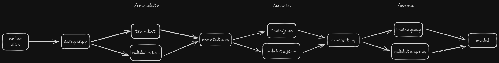

# NER Model Service

The **NER Model Service** is a specialized backend application designed to perform Named Entity Recognition (NER) on incoming text data. It identifies, classifies, and extracts key entities such as names, dates, locations, and custom-defined entities. Built with a state-of-the-art Spacy machine learning model, this service provides fast and accurate entity recognition while being highly scalable and integrable with other services.

This projects shows how 

## Key Features
- Collects and prepare data to train the NER Model.
- Extracts predefined entities from unstructured text, including.
- Exposed an API to handler requests feom external service.

## Project Structure

- `project.yml`: Defines the data assets, commands, and workflows for the project.
- `scripts/`: Contains various scripts for data preparation, conversion, and prediction.
  - `annotate.py`: Annotates raw data.
  - `convert.py`: Converts annotated data to spaCy's binary format.
  - `predict.py`: Provides a function to make predictions using the trained model.
  - `app.py`: Exposes the trained model via a Flask API.
- `raw_data/`: Contains raw data files.
- `assets/`: Contains annotated data files.
- `corpus/`: Contains converted data files in spaCy's binary format.
- `output/`: Contains the trained model.


## How to Train the Model

### 1. Data Collection and Cleaning
- We created a dataset to detect entities like kitchen type, number of bathrooms, and rooms from real estate descriptions.
- Using the Parsehub scraper, we collected textual descriptions from multiple real estate ads.
- The scraped data was passed through a cleaning function to remove special characters and new lines.
- The cleaned data was split: 80% for training and 20% for validation.

### 2. Labeling and Transforming Data
- spaCy requires training data in the form of a list of tuples, each containing the text and a dictionary with entity indices and labels.
- The data needs to be labeled and transformed into a format compatible with spaCy.

### 3. Labeling Data
- The performance of an NER model depends on both the quality and quantity of labeled data.
- To label the data efficiently, we automated the process using spaCy’s **EntityRuler**:
  - The **EntityRuler** uses pattern matching and regular expressions to find and label entities.
  - This allowed us to automatically label a large number of ad descriptions, adding new patterns whenever needed.

### 4. Training the Model
- After preparing the training and validation data, the model is ready to be trained.




## Architecture
1. **Text Input Reception**: Receives raw text via API calls.
2. **NER Model Execution**:
   - The input text is preprocessed.
   - The NER model identifies and extracts entities.
3. **Post-Processing**: Refines and structures the recognized entities for further consumption.
4. **Response Delivery**: Returns enriched entity data to clients or downstream services.


## Technologies
- **Machine Learning Models**: Leverages models trained using frameworks like Hugging Face or SpaCy for NER.

## Getting Started
1. Clone the repository:
   ```bash
   git clone https://github.com/your-repo/ner-model-service.git


## Setup

1. **Install Dependencies**:
   ```sh
   pip install -r requirements.txt
   ```

2. **Scrape Data**:
   Run the `scraper.py` script to fetch raw data using ParseHub.
   ```sh
   python scripts/scraper.py
   ```

3. **Annotate Data**:
   Run the `annotate.py` script to annotate the raw data.
   ```sh
   python scripts/annotate.pys
   ```

4. **Convert Data**:
   Run the `convert` command to convert the annotated data to spaCy's binary format.
   ```sh
   spacy project run convert
   ```

5. **Train the Model**:
   Run the `train` command to train the NER model.
   ```sh
   spacy project run train
   ```

## Commands

The following commands are defined in the `project.yml` file. They can be executed using `spacy project run [name]`. Commands are only re-run if their inputs have changed.

| Command  | Description                                 |
| -------- | ------------------------------------------- |
| `convert`| Convert the data to spaCy's binary format   |
| `train`  | Train a named entity recognition model      |

## Workflows

Workflows are sequences of commands executed in order. You can run them via `spacy project run [workflow]`.

| Workflow | Description                                 |
| -------- | ------------------------------------------- |
| `all`    | Runs the `convert` and `train` commands     |

## Scripts

### `scraper.py`

This script scrapes raw data using ParseHub and saves it into text files.

**Input**: None.  
**Output**: Raw data in text files.

### `annotate.py`

This script annotates raw data and saves it into JSON files.

**Input**: Raw data in text format.  
**Output**: Annotated data in JSON format.

### `convert.py`

This script converts annotated data into spaCy's binary format.

**Input**: Annotated data in JSON format.  
**Output**: Data in spaCy's binary format.


### `predict.py`

This script exposes the trained model via a Flask API for predictions.

## Expose the Model via API

To expose the trained model for API use, you can use the `predict.py` script.

1. **Install Flask**:
   ```sh
   pip install flask
   ```

2. **Start the Flask Server**:
   ```sh
   python scripts/predict.py
   ```

3. **Make a Prediction Request**:
   ```sh
   curl -X POST http://localhost:5000/predict -H "Content-Type: application/json" -d '{"text": "Your text here"}'
   ```

## License

This project is licensed under the MIT License.