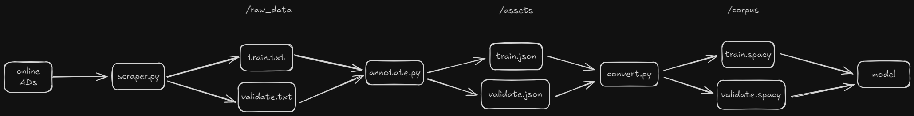

# NER Model Project

This project is focused on training a Named Entity Recognition (NER) model using spaCy. The project includes scripts for data scraping, data preparation, model training, and exposing the trained model via an API for predictions.


## Project Structure

- `project.yml`: Defines the data assets, commands, and workflows for the project.
- `scripts/`: Contains various scripts for data preparation, conversion, and prediction.
  - `scraper.py`: Scrapes raw data using ParseHub.
  - `annotate.py`: Annotates raw data.
  - `convert.py`: Converts annotated data to spaCy's binary format.
  - `predict.py`: Provides a function to make predictions using the trained model.
  - `predict.py`: Exposes the trained model via a Flask API.
- `raw_data/`: Contains raw data files.
- `assets/`: Contains annotated data files.
- `corpus/`: Contains converted data files in spaCy's binary format.
- `output/`: Contains the trained model.

## Project workflow


## Data Source

The raw data for this project is scraped using [ParseHub](https://www.parsehub.com/), a visual data extraction tool. The `scraper.py` script is used to run the ParseHub scraper and fetch the data, which is then saved into text files for further processing.

## Setup

1. **Install Dependencies**:
   ```sh
   pip install -r requirements.txt
   ```

2. **Scrape Data**:
   Run the `scraper.py` script to fetch raw data using ParseHub.
   ```sh
   python scripts/scraper.py
   ```

3. **Annotate Data**:
   Run the `annotate.py` script to annotate the raw data.
   ```sh
   python scripts/annotate.py
   ```

4. **Convert Data**:
   Run the `convert` command to convert the annotated data to spaCy's binary format.
   ```sh
   spacy project run convert
   ```

5. **Train the Model**:
   Run the `train` command to train the NER model.
   ```sh
   spacy project run train
   ```

## Commands

The following commands are defined in the `project.yml` file. They can be executed using `spacy project run [name]`. Commands are only re-run if their inputs have changed.

| Command  | Description                                 |
| -------- | ------------------------------------------- |
| `convert`| Convert the data to spaCy's binary format   |
| `train`  | Train a named entity recognition model      |

## Workflows

Workflows are sequences of commands executed in order. You can run them via `spacy project run [workflow]`.

| Workflow | Description                                 |
| -------- | ------------------------------------------- |
| `all`    | Runs the `convert` and `train` commands     |

## Scripts

### `scraper.py`

This script scrapes raw data using ParseHub and saves it into text files.

**Input**: None.  
**Output**: Raw data in text files.

### `annotate.py`

This script annotates raw data and saves it into JSON files.

**Input**: Raw data in text format.  
**Output**: Annotated data in JSON format.

### `convert.py`

This script converts annotated data into spaCy's binary format.

**Input**: Annotated data in JSON format.  
**Output**: Data in spaCy's binary format.


### `predict.py`

This script exposes the trained model via a Flask API for predictions.

## Expose the Model via API

To expose the trained model for API use, you can use the `predict.py` script.

1. **Install Flask**:
   ```sh
   pip install flask
   ```

2. **Start the Flask Server**:
   ```sh
   python scripts/predict.py
   ```

3. **Make a Prediction Request**:
   ```sh
   curl -X POST http://localhost:5000/predict -H "Content-Type: application/json" -d '{"text": "Your text here"}'
   ```

## License

This project is licensed under the MIT License.